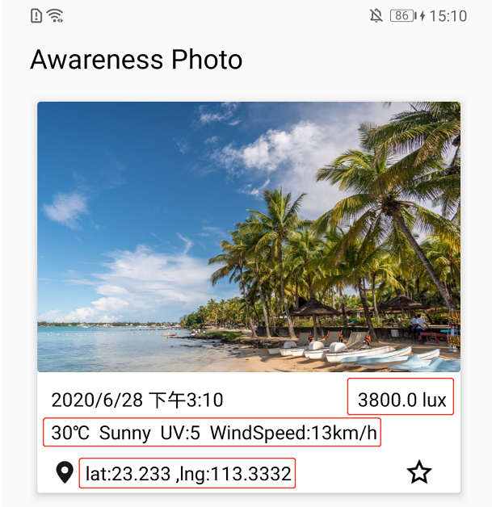
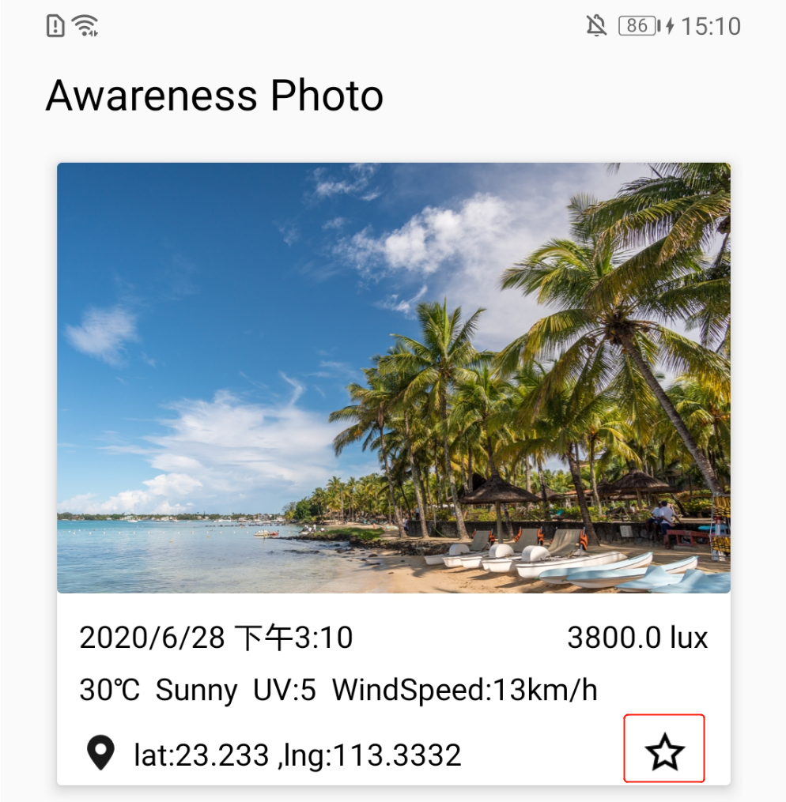

## Introduction

A simple Android photograph app integrated with HMS Awareness Kit.

The app can obtain the weather, light intensity, location information Through the HMS Awareness kit and attach the information to the pictures you took, which make the picture more vivid.

If you are interested in some photo, you can click the collection icon to register Barrier to HMS Awareness Kit. When you are in the same condition(location, time, light) as the collected photo, the PendingIntent of the barrier will trigger by HMS Awareness Kit and send the notification to notify user to take the picture.

[More information about HMS Awareness Kit.](https://developer.huawei.com/consumer/en/hms/huawei-awarenesskit)